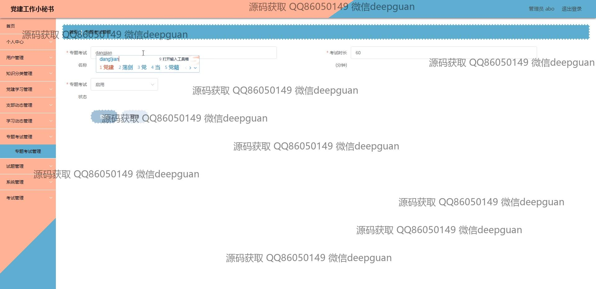
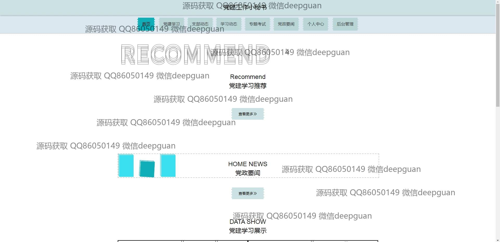

<h1 align="center">党建工作小秘书</h1>

## 简介
党建工作小秘书系统：角色分为管理员、用户；提供党建学习、支部动态、知识管理、专题考试等功能，支持党建工作的数字化管理与组织。    --计算机毕业设计源码；毕设源码；java毕业设计源码

## 联系方式

<h3 align="center">获取完整代码与数据库文件 + 微信：deepguan QQ: 86050149 QQ群: 783742310</h3>

<h3 align="center">可帮忙远程部署 包运行成功！提供远程部署、修改代码、设计文档指导、代码讲解等服务！</h3>

## 功能介绍（完整见运行截图）
管理员：登录、注册、退出功能；管理导航栏、学习动态、支部动态、专题考试等模块；提供用户管理、知识分类管理、党建学习管理等操作；支持考试管理和试题分析功能，便于党建工作的全面管理。

用户：支持个人中心信息查看与编辑；参与党建学习、支部动态、学习动态和专题考试；可查看党建要闻和支部活动记录；提供在线考试参与和错题本功能，提升学习和考试体验。

考生：参与专题考试和试题练习；查看考试成绩和错题记录；支持考试倒计时管理和试题分析；便于掌握学习进度和提升知识储备。

系统管理员：负责后台系统管理，包括轮播图管理、文件上传、考试设置和权限分配；优化系统操作流程，确保党建相关内容的高效维护和更新。

## 运行截图

本代码来源于网络,仅供学习参考使用!

